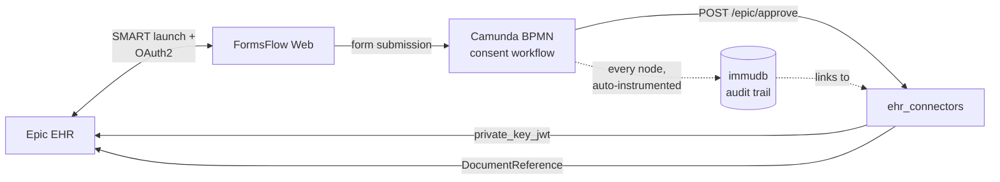
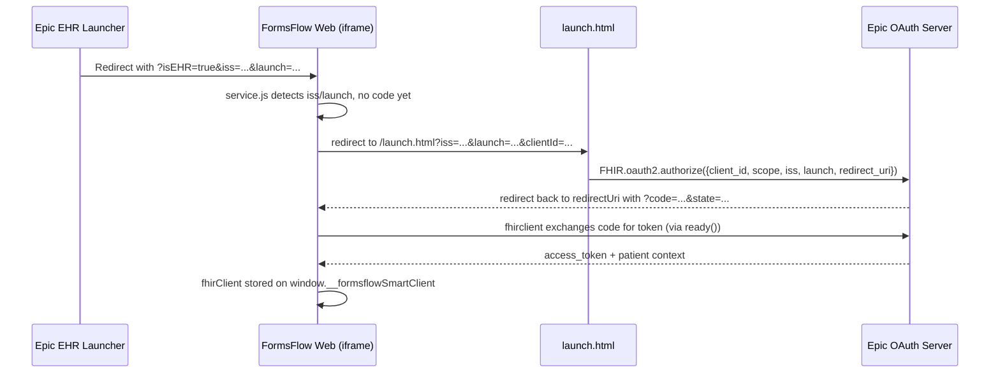
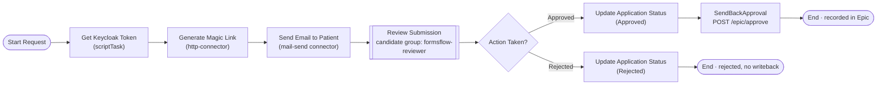
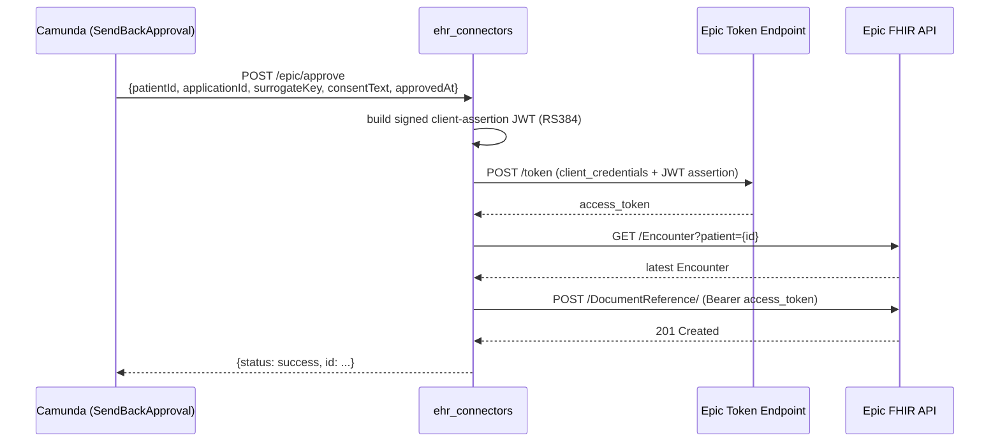

# FormsFlow EHR — Epic SMART on FHIR Integration Guide

---

## 1. Overview & Purpose

**What this covers**: how a provider launches FormsFlow from inside Epic, how that launch becomes an authenticated session with patient context, how the consent decision workflow runs end-to-end in Camunda (including how an unauthenticated patient participates via a magic link), how the outcome is written back to Epic as a FHIR `DocumentReference`, and how every step of that chain is captured in an independent, tamper-evident audit trail that can be inspected after the fact.

**How the pieces fit together**:



Two things about this diagram are worth internalizing before reading further, because they shape how the rest of the guide is organized: the dashed lines into immudb mean audit logging is **automatic and process-agnostic** — no workflow author wires it in (Section 7) — and `ehr_connectors` is the **only** component that ever talks to Epic directly; neither FormsFlow Web nor Camunda hold Epic credentials themselves (Sections 3 and 6). Everything from here on is one of these five boxes, or an arrow between two of them, described in depth.

---

## 2. Epic SMART on FHIR Fundamentals

Before the code, it's worth being precise about four terms this guide uses constantly, since they get thrown around loosely elsewhere.

**FHIR** is Epic's (and the industry's) standard data model for clinical data — a `Patient`, an `Encounter`, a `DocumentReference` are all FHIR *resources*, each with a predictable JSON shape. Everything this integration reads from or writes to Epic is expressed as one of these resource types.

**SMART on FHIR** is a standard way for a third-party app — FormsFlow, in this case — to be trusted by an EHR like Epic and granted scoped access to that data, without Epic having to build FormsFlow-specific integration code. Epic just needs to know FormsFlow as a registered "SMART app," and FormsFlow just needs to speak SMART's OAuth2-based launch protocol.

**EHR launch** is the specific case where the *provider's own EHR session* is what starts things — a doctor is already logged into Epic, looking at a specific patient, and clicks a link or button that opens FormsFlow *in that context*. This is different from a patient logging into a portal on their own; the launch itself carries "who is the current user" and "which patient are we looking at" as part of the handshake, which is what lets a form open already knowing which patient it's for. Section 3 covers exactly how that context gets passed and turned into an authenticated session.

**Consent, conceptually, in this system**: "consent" here doesn't mean a checkbox at the bottom of a form — it's a full decision workflow. A provider initiates a request (via the EHR launch), the *patient* is the one who actually has to review and approve or reject it, and Epic needs a durable, queryable record that this happened. That last requirement is why the outcome is written back as a `DocumentReference` (Section 6) rather than just stored in FormsFlow's own database — Epic itself needs to be able to show, on the patient's chart, that consent was requested and what the patient decided.

Put together, the shape of the integration is: **an EHR launch establishes who/which-patient → SMART on FHIR authenticates the app for that context → a workflow captures a human decision → FHIR write-back records that decision where Epic (and anyone looking at the patient's chart) can see it.** The rest of this guide is that same shape, one layer of implementation detail at a time: Section 3 is the "establish + authenticate" half, Sections 5–6 are the "capture a decision + write it back" half, and Sections 7–8 are how that whole chain stays inspectable after the fact.

---

## 3. Authentication & Launch Flow

Section 2 covered the *concepts*. This section covers what actually runs in the browser when a provider clicks launch button and select patient from patient chart: a small handshake between three actors — Epic's EHR launcher, a static `launch.html` page, and the FormsFlow React app — that ends with an authenticated `fhirclient` SMART client the rest of the app can use.

### 3.1 EHR app registration (Epic sandbox)

Before any of the runtime flow works, `formsflow` has to exist as a registered SMART app in Epic's sandbox:

| Setting | Value |
|---|---|
| App name | `formsflow` |
| JWKS endpoint | `https://fhir-connector-auth.aot-technologies.com/.well-known/jwks.json` |

That JWKS endpoint is registered in Epic as the app's **Non-Production JWK Set URL** — it's how Epic verifies the signed JWTs used for backend-services calls (the same mechanism `ehr_connectors` uses in Section 6.3 to authenticate its writeback calls).


We use these values on EHR launcher
| Launch type | SMART Health IT EHR Launch & Provider EHR Launch |
| Iframe | "Open in iframe" enabled |
| Launch URL | `fhir-epic.aot-technologies.com/form` |

### 3.2 The flow, end to end



### 3.3 Step 1 — detecting the launch context

The app first has to tell the difference between "just opened normally" and "opened from inside Epic." That's `launchSMART()` in `forms-flow-web/src/integrations/ehr/service.js`, which reads both the URL and anything already stashed in `sessionStorage` from a previous redirect in this same flow:

```javascript
const urlParams = new URLSearchParams(window.location.search);
const code = urlParams.get('code') || sessionStorage.getItem('epic_code');
const state = urlParams.get('state') || sessionStorage.getItem('epic_state');
const iss = urlParams.get('iss') || sessionStorage.getItem('epic_iss');
const launch = urlParams.get('launch') || sessionStorage.getItem('epic_launch');
```

`sessionStorage` matters here because the OAuth redirect round-trip (step 2 below) can lose the original `iss`/`launch` query params by the time the browser lands back on the app — stashing them means they survive the trip.

If `iss` and `launch` are present but there's no `code` yet, the app hasn't started the OAuth handshake — so it redirects to `launch.html`, carrying everything it'll need forward as query params:

```javascript
if (iss && launch && !code) {
  let launchUrl = `/launch.html?iss=${encodeURIComponent(iss)}&launch=${encodeURIComponent(launch)}`;
  launchUrl += `&clientId=${encodeURIComponent(clientId)}&redirectUri=${encodeURIComponent(redirectUri)}&scope=${encodeURIComponent(scope)}`;
  window.location.href = launchUrl;
}
```

### 3.4 Step 2 — starting OAuth from `launch.html`

`launch.html` (`forms-flow-web-root-config/public/launch.html`) is a deliberately minimal static page — no React, no build step — whose only job is to hand off to the `fhirclient` library's own OAuth kickoff:

```javascript
FHIR.oauth2.authorize({
  client_id: config.clientId,
  scope: config.scope,
  redirect_uri: finalRedirectUri,
  iss: iss,
  launch: launch
});
```

This redirects the browser to Epic's OAuth server, which shows Epic's own login screens (outside FormsFlow entirely) and then redirects back to `finalRedirectUri` with a `code` and `state` — at which point control returns to the React app.

### 3.5 Step 3 — completing the token exchange

Back in `service.js`, `launchSMART()` sees `code`/`state` on this second pass and calls `fhirclient`'s `ready()` to finish the exchange:

```javascript
if (code || state) {
  const readyOptions = {
    clientId: clientId,
    scope: scope,
    redirectUri: redirectUri,
    iss: storedIss,
    launch: storedLaunch,
  };
  const fhirClient = await ready(adapter, readyOptions); // completes the OAuth token exchange
  return fhirClient;
}
```

The caller (`epicConsent.js`'s `initializeSMART()`) then pins the resulting client to `window.__formsflowSmartClient`, so any other part of the app — the prefill logic in Section 4, or the consent-submission helper — can reach it without threading it through component props:

```javascript
const client = await launchSMART(clientId, redirectUri, scope);
if (client) {
  window.__formsflowSmartClient = client;
}
```

From here, the SMART client is ready: it carries the access token, the patient context Epic granted at launch, and enough state for the app to call `client.patient.read()` or `client.request(...)` directly — which is exactly what Section 4 does next.

---

## 4. Patient Data Retrieval & Prefill

Once `window.__formsflowSmartClient` exists (Section 3.5), the React hook `useEhrPatientData` (`forms-flow-web/src/integrations/ehr/hooks.js`) fetches the launch-context patient with a single call — `fetchPatientData(fhirClient)` — which resolves to the raw FHIR `Patient` resource via `client.request('Patient/{id}')`.

The interesting part is what happens next, in `forms-flow-web/src/integrations/ehr/mapper.js`: the FHIR resource's nested structure (`name[].given[]`/`family`, `telecom[]`, `address[].line[]`, etc.) doesn't line up 1:1 with arbitrary Form.io field keys, so a small matching layer flattens it and scores candidate matches by keyword overlap rather than relying on exact key names:

```javascript
function scoreStrings(a, b) {
  const wa = normalize(a).split(' ').filter(w => w.length > 1);
  const wb = normalize(b).split(' ').filter(w => w.length > 1);
  const setA = new Set(wa), setB = new Set(wb);
  let overlap = 0;
  setA.forEach(w => { if (setB.has(w)) overlap++; });
  return overlap / Math.max(setA.size, setB.size);
}
```

This is why a FHIR key like `given` can land correctly on a form field labeled `firstName` or `fname` — `findBestField()` also layers in a small hardcoded map of known FHIR-to-form synonyms (`given → first/firstname/fname`, `birthDate → dob/dateofbirth`, etc.) on top of the raw score, boosting exact/known matches over coincidental keyword overlap.

Once mapped, `forms-flow-web/src/routes/Submit/Forms/UserForm.js` pushes the values directly onto the live Form.io component instances (rather than only updating `formInstance.submission`), because Form.io doesn't reliably re-render from a submission-object update alone:

```javascript
Object.keys(submissionData.data).forEach(key => {
  const component = formInstance.getComponent(key);
  if (component) component.setValue(value, { modified: false });
});
formInstance.redraw();
```

This whole path is what turns "provider clicks launch in Epic" into "form opens already filled in with the selected patient's name, DOB, and contact details." It's shared infrastructure — the same launch, auth, and prefill mechanism underlies every Epic-launched form in this system, not just Patient Consent — which is why it gets its own section instead of being folded into Section 5.

---

## 5. Consent Workflow — Camunda Deep Dive

Once a doctor or staff member launches FormsFlow from the Epic EHR launcher and submits the pre-filled consent form, control passes entirely to a single Camunda process. Everything from that point on — notifying the patient, capturing their decision, and writing the outcome back to Epic — is orchestrated by this one BPMN definition. It has no swimlanes; it's a single, linear flow, which keeps it easy to reason about even though several different systems participate along the way.

### 5.1 The flow at a glance



### 5.2 Task-by-task walkthrough

| # | Element | Type | What it does |
|---|---------|------|---------------|
| 1 | `StartEvent_1` "Start Request" | Start event | A `start` listener reads the `surrogateKey` process variable that arrived with the form submission. If it's missing for any reason, it generates one server-side as a fallback (`java.util.UUID.randomUUID()`). This key is the thread that ties the application, the process instance, the audit log, and the Epic writeback together — more on that in [§5.5](#55-surrogatekey-the-thread-that-ties-it-all-together) and [Section 7](#7-audit-trail--immudb-module). |
| 2 | `Activity_GetKeycloakToken` "Get Keycloak Token" | Script task | Plain Java/JS: reads `KEYCLOAK_URL`, `KEYCLOAK_CLIENTID`, `KEYCLOAK_CLIENTSECRET` from the environment, does a `client_credentials` token request against Keycloak, and stores the result in `kcAccessToken`. This token authenticates the *next* step's call into `forms-flow-custom-services`. |
| 3 | `Activity_RequestMagicLink` "Generate Magic Link" | Service task (`http-connector`) | POSTs to `forms-flow-custom-services`' magic-link API (see [§5.3](#53-the-magic-link-how-an-unauthenticated-patient-gets-in)) using the token from step 2. The response's `magic_link` is captured into `patientMagicLink`. |
| 4 | `Activity_SendEmail` "Send Email to Patient" | Service task (`mail-send` connector) | Emails the patient at `eMailAddress` (falling back to `submitterEmail` or `email`) with the subject *"EPIC FHIR Patient Consent Signature Required"*, embedding the magic link and a 48-hour validity notice. |
| 5 | `reviewer` "Review Submission" | User task, candidate group `/formsflow/formsflow-reviewer` | The patient opens the emailed link and submits a decision. The task's `action` field becomes the `applicationStatus` on completion. |
| 6 | `ExclusiveGateway_0l1c65j` "Action Taken?" | Exclusive gateway | Branches on `${action == 'Approved'}` vs. `${action == 'Rejected'}`. |
| 7 | `Task_1hko8r7_Approved` / `Task_1hko8r7_Rejected` | Task (both named "Update Application Status") | Identical shape on both branches: sync `applicationId`, `applicationStatus`, `surrogateKey`, `patientId` back to FormsFlow via `BPMFormDataPipelineListener`, `FormSubmissionListener`, and `ApplicationStateListener`. |
| 8 | `Activity_1gtnbpo` "SendBackApproval" | Service task (`http-connector`) | **Approved path only.** POSTs to Epic writeback — covered in full in [Section 6](#6-epic-writeback-documentreference). |
| 9 | `EndEvent_03cla68` | End event | Both branches converge here. Rejected submissions end with no Epic interaction at all — there is no rejection record written to Epic; the audit trail (Section 7) is the only record of a rejection. |

### 5.3 The magic link: how an unauthenticated patient gets in

The patient reviewing and signing the form has no FormsFlow account — they're an external party reached purely by email. The process solves this with a scoped, time-limited "magic link" rather than asking the patient to register:

```javascript
// Activity_RequestMagicLink — payload sent to forms-flow-custom-services
var email = execution.getVariable('eMailAddress')
         || execution.getVariable('submitterEmail')
         || execution.getVariable('email')
         || 'patient@example.com';
var pid = execution.getProcessInstanceId();

JSON.stringify({
  "email": email,
  "processInstanceId": pid,
  "iss": "epic-fhir-portal",
  "aud": "patient-consent",
  "token_expiry": 2880          // minutes → 48 hours
});
```

This is sent to `/custom-services-api/v1/magic-links/request`, authenticated with the service-account token minted in step 2. The `iss`/`aud` pair scopes the resulting link specifically to the patient-consent flow, and `token_expiry: 2880` caps its usable window to 48 hours — matching the wording in the email itself. Clicking the link is what lets the patient land on and complete the `reviewer` task without ever holding a FormsFlow login.

### 5.4 The approve/reject gateway

Whatever the patient chose becomes `applicationStatus` verbatim, which is exactly what the gateway's two condition expressions test:

```xml
<bpmn:sequenceFlow id="SequenceFlow_1x38yu4" name="approve" ...>
  <bpmn:conditionExpression>${action == 'Approved'}</bpmn:conditionExpression>
</bpmn:sequenceFlow>
<bpmn:sequenceFlow id="SequenceFlow_0pc6hcp" name="reject" ...>
  <bpmn:conditionExpression>${action == 'Rejected'}</bpmn:conditionExpression>
</bpmn:sequenceFlow>
```

Both outcomes route through an identically-shaped "Update Application Status" task — the only difference is which task instance ran, which is itself enough for the audit trail (Section 7) to distinguish an approval from a rejection. There's no separate "resubmit" or "return" path in this workflow

### 5.5 `surrogateKey` — the thread that ties it all together

`surrogateKey` is generated (or received) at the very first step and is explicitly re-propagated at almost every node from there on — the gateway, both status-update tasks, and the final writeback call all carry it forward. That's deliberate: it's the one identifier that's guaranteed to be present in the FormsFlow application record, the Camunda process variables, the immutable audit log, and the payload sent to Epic, which makes it possible to reconstruct "everything that happened to this one consent request" across four different systems. Section 7 covers how immudb uses this key as its primary correlation field.

### 5.6 Epic writeback, briefly

On the approved path, `Activity_1gtnbpo` ("SendBackApproval") POSTs a small JSON payload — `patientId`, `applicationId`, `surrogateKey`, a fixed `consentText`, and a timestamp — to `ehr_connectors`' `/epic/approve` endpoint (reached over Docker's internal network at `http://ehr-connectors:8002`):

```javascript
JSON.stringify({
  "patientId":     patientId,
  "applicationId": applicationId,
  "surrogateKey":  surrogateKey,
  "consentText":   "Patient has approved the consent form.",
  "approvedAt":    approvedAt
});
```

What happens on the receiving end — the JWT-based service authentication and the actual FHIR `DocumentReference` that gets built and posted to Epic — is detailed in full in [Section 6](#6-epic-writeback-documentreference), so it isn't duplicated here.

---

## 6. Epic Writeback (DocumentReference)

When the Camunda process (Section 5) reaches `SendBackApproval`, it hands off to `ehr_connectors` — a standalone Python/FastAPI service that owns all direct communication with Epic's FHIR API. This is a deliberate separation: Camunda never holds Epic credentials or talks to Epic directly. It only knows one internal URL, `/epic/approve`, and everything about *how* to authenticate to Epic and *what* FHIR shape to send lives in this one service.

### 6.1 Sequence



### 6.2 The endpoint

`ehr_connectors/src/main.py` exposes the receiving side as a plain FastAPI route with a typed request body:

```python
class ApprovalRequest(BaseModel):
    patientId: str
    consentText: str
    surrogateKey: Optional[str] = None
    approvedAt: Optional[str] = None

@app.post("/epic/approve")
async def approve_to_epic(request: ApprovalRequest):
    """
    Endpoint to be called by Service Task to send approval status to Epic.
    """
    result = await epic_service.send_approval_status(
        patient_id=request.patientId,
        consent_text=request.consentText,
        surrogate_key=request.surrogateKey,
        approved_at=request.approvedAt,
    )
    return {"ok": True, "result": result}
```

Everything else happens inside `EpicService`, in `ehr_connectors/src/services/epic_service.py`.

### 6.3 Authenticating to Epic: private\_key\_jwt (SMART Backend Services)

`ehr_connectors` doesn't hold a static Epic access token — it mints a short-lived one on every call, using Epic's **Backend Services (`private_key_jwt`)** flow. This is the standard SMART on FHIR pattern for *system-to-system* calls (no user in the loop, unlike the patient/provider-facing launch in Section 3): the connector signs a JWT with its own private key, and Epic verifies it against the public JWKS URL registered for the app (the same `fhir-connector-auth.aot-technologies.com/.well-known/jwks.json` endpoint mentioned in Section 1).

```python
def _generate_client_jwt(self) -> str:
    now = int(datetime.now(tz=timezone.utc).timestamp())
    payload = {
        "iss": self.settings.EPIC_CLIENT_ID,
        "sub": self.settings.EPIC_CLIENT_ID,
        "aud": self.settings.EPIC_TOKEN_URL,
        "jti": str(uuid.uuid4()),
        "iat": now,
        "nbf": now,
        "exp": now + 300,  # 5 minutes; Epic's own maximum
    }
    headers = {"alg": "RS384", "typ": "JWT", "kid": self.settings.EPIC_KID}
    private_key_pem = codecs.decode(self.settings.EPIC_PRIVATE_KEY, "unicode_escape")
    return jwt.encode(payload, private_key_pem, algorithm="RS384", headers=headers)
```

That JWT is then exchanged for a real access token, scoped explicitly to what this service is allowed to do — read Patients, Encounters, and Binaries, and create/read DocumentReferences:

```python
payload = {
    "grant_type": "client_credentials",
    "client_assertion_type": "urn:ietf:params:oauth:client-assertion-type:jwt-bearer",
    "client_assertion": client_assertion,
    "scope": "system/DocumentReference.c system/DocumentReference.read "
             "system/Binary.read system/Patient.read system/Encounter.read",
}
response = await client.post(self.settings.EPIC_TOKEN_URL, data=payload, ...)
```

Two details worth noting: the JWT is only valid for 5 minutes (`exp = now + 300`) because that's Epic's own hard limit, not an arbitrary choice — and the scope list is a fixed, minimal set

### 6.4 Building and posting the `DocumentReference`

Before writing the document, the service looks up the patient's most recent `Encounter` — Epic expects clinical documents to be contextualized to a visit where possible:

```python
async def get_latest_encounter(self, patient_id: str, token: str) -> str:
    url = f"/Encounter?patient={patient_id}"
    response = await self.client.get(
        url, headers={"Authorization": f"Bearer {token}", "Accept": "application/fhir+json"}
    )
    data = response.json()
    if data.get("resourceType") == "Bundle" and "entry" in data:
        for entry in data.get("entry", []):
            res = entry.get("resource", {})
            if res.get("resourceType") == "Encounter":
                return res.get("id")
    return None
```

If no encounter is found, the write proceeds anyway — a warning is logged, and the `context.encounter` field is simply omitted. The `DocumentReference` itself is built as a fairly standard FHIR consent/progress-note document:

```python
document_reference = {
    "resourceType": "DocumentReference",
    "status": "current",
    "masterIdentifier": {"system": "http://formsflow.ai/surrogate-key", "value": surrogate_key},
    "identifier": [{"system": "http://formsflow.ai/surrogate-key", "value": surrogate_key}],
    "type": {
        "coding": [{"system": "http://loinc.org", "code": "11506-3", "display": "Progress note"}],
        "text": "Patient Consent Form",
    },
    "category": [{"coding": [{
        "system": "http://hl7.org/fhir/us/core/CodeSystem/us-core-documentreference-category",
        "code": "clinical-note", "display": "Clinical Note",
    }]}],
    "subject": {"reference": f"Patient/{patient_id}"},
    "date": approved_at,
    "content": [{
        "attachment": {
            "contentType": "text/plain",
            "data": base64.b64encode((consent_text + f" The surrogate Key is {surrogate_key}").encode()).decode(),
            "title": f"Patient Consent Form - Ref: {surrogate_key}",
        }
    }],
    "context": {"encounter": [{"reference": f"Encounter/{encounter_id}"}]} if encounter_id else {},
}

response = await self.client.post(
    "/DocumentReference/",
    json=document_reference,
    headers={"Authorization": f"Bearer {token}", "Content-Type": "application/fhir+json", "Accept": "application/fhir+json"},
)
```

Two points worth calling out for anyone extending this:

- **`surrogateKey` is embedded twice** — once structurally, as `masterIdentifier`/`identifier` (so it's queryable by other FHIR-aware tooling), and once in plain text inside the document's base64-encoded content. This means the same correlation ID that threads through Camunda and immudb (Section 7) is also recoverable directly from the Epic-side record, without needing to cross-reference FormsFlow at all.
- **LOINC code `11506-3` ("Progress note") is hardcoded** as the document type, and the `author` field (in the current code) points to a fixed placeholder practitioner reference rather than the actual reviewing clinician — both are candidates to revisit if this pattern is reused for a different document type or if per-author attribution becomes a requirement.

A `201` response is treated as success and the created resource's ID is extracted (from the JSON body if returned, otherwise from the `Location` header); anything else is logged with the full Epic error body and re-raised, so a rejected write surfaces as a failed Camunda service task rather than failing silently.

---

## 7. Audit Trail — immudb Module

Everything described in Sections 5 and 6 needs a tamper-evident record: which process ran, which task fired, what was sent to Epic, and what Epic sent back. That record is kept in **immudb**, a standalone service that sits outside both Camunda and FormsFlow and is written to automatically — no BPMN author has to remember to log anything.

### 7.1 What it is and what it stores

`forms-flow-immudb` (`forms-flow-immudb/src/formsflow_immudb/`) is a small Flask microservice wrapping [immudb](https://immudb.io), a cryptographically verifiable, append-only database. Its single table, `audit_logs`, is created on startup:

```python
CREATE TABLE IF NOT EXISTS audit_logs (
    id INTEGER AUTO_INCREMENT PRIMARY KEY,
    tenant_id VARCHAR,
    event_name VARCHAR,
    user_id VARCHAR,
    surrogate_key VARCHAR,
    request_data VARCHAR,
    response_data VARCHAR,
    indexed_json VARCHAR,
    created_at VARCHAR
)
```

Every row is one event — a task starting, a task ending, a service call going out, a response coming back — tied together by `surrogate_key`, the same correlation ID introduced in Section 5.5. The service exposes a small REST API (`api/audit_api.py`): `POST /audit/log` and `/audit/log/batch` to write, `GET /audit/query`, `/audit/search`, and `/audit/surrogate-key` to read.

### 7.2 How BPMN events get in — without any BPMN change

This is the part worth pausing on: **nothing in any `.bpmn` file references immudb.** You won't find it if you search the consent workflow, or any other process. Instead, a Camunda process-engine plugin instruments every process automatically, at parse time, before any of them run.

`AuditParseListener` (`ehr_connectors/immudb-audit-plugin/src/main/java/org/camunda/bpm/extension/hooks/audit/AuditParseListener.java`) hooks into Camunda's BPMN parser itself:

```java
public class AuditParseListener extends AbstractBpmnParseListener {
    private final ExecutionListener auditListener = new AuditExecutionListener();

    @Override
    public void parseStartEvent(Element el, ScopeImpl scope, ActivityImpl activity) { addAuditListener(activity); }
    @Override
    public void parseEndEvent(Element el, ScopeImpl scope, ActivityImpl activity) { addAuditListener(activity); }
    @Override
    public void parseServiceTask(Element el, ScopeImpl scope, ActivityImpl activity) { addAuditListener(activity); }
    @Override
    public void parseUserTask(Element el, ScopeImpl scope, ActivityImpl activity) { addAuditListener(activity); }
    @Override
    public void parseCallActivity(Element el, ScopeImpl scope, ActivityImpl activity) { addAuditListener(activity); }

    private void addAuditListener(ActivityImpl activity) {
        activity.addExecutionListener(ExecutionListener.EVENTNAME_START, auditListener);
        activity.addExecutionListener(ExecutionListener.EVENTNAME_END, auditListener);
    }
}
```

Every start event, end event, service task, user task, and call activity — in *every* deployed process, including the consent workflow from Section 5 — gets the same `AuditExecutionListener` attached to both its `start` and `end`. Registered once via `AuditProcessEnginePlugin`, this runs at deployment/parse time, so it applies uniformly across the whole BPM engine rather than being something each process has to opt into individually.

### 7.3 What actually gets logged

`AuditExecutionListener.notify()` fires on every one of those start/end events and assembles a payload from whatever process variables happen to be in scope:

```java
requestData.put("processInstanceId", execution.getProcessInstanceId());
requestData.put("activityId", execution.getCurrentActivityId());
requestData.put("activityName", execution.getCurrentActivityName());
requestData.put("eventName", execution.getEventName());
requestData.put("timestamp", Instant.now().toString());
if (execution.hasVariable("surrogateKey")) requestData.put("surrogateKey", execution.getVariable("surrogateKey"));
if (execution.hasVariable("patientId"))    requestData.put("patientId", execution.getVariable("patientId"));
if (execution.hasVariable("request"))      requestData.put("connectorRequest", execution.getVariable("request"));
// ...same pattern for responseData, using "response" instead of "request"

finalPayload.put("event_name", "BPMN_" + eventName.toUpperCase() + "_" + activityId);
```

So for the consent workflow, this produces entries like `BPMN_START_reviewer`, `BPMN_END_Activity_1gtnbpo`, and so on — one pair per node, each carrying whatever `surrogateKey`/`patientId`/connector request-response data was set at that point. This is why the writeback call in Section 6 shows up in the audit trail even though the connector itself never talks to immudb directly — the *listener wrapping the task* captures the `request`/`response` variables Camunda's http-connector already populates.

Two operational details:
- **Fire-and-forget delivery.** `sendToImmudb()` uses Java's async `HttpClient` and only logs a warning on failure — a slow or unreachable immudb service degrades logging, not the workflow itself.
- **Opt-out, not opt-in.** Auditing defaults to *on* for every process (`IMMUDB_AUDIT_ENABLED_DEFAULT` defaults to `true`); a process can disable it for itself by setting a process variable named `immudb_audit_enabled` (or whatever `IMMUDB_AUDIT_VARIABLE_NAME` is configured to) to `false`.

### 7.4 The report UI

`forms-flow-immudb`'s `resources/report.py` serves a self-contained `/report` page — search/filter by tenant, event name, user, and date range, a paginated results table, and a JSON viewer modal for inspecting a single logged payload in full. Its most notable feature is an "EHR Actions" column: for any row whose payload contains a `patient_id`, `docref_id`, or `encounter_id`, it renders a direct link into the FHIR Viewer (Section 8) — e.g. `{EHR_CONNECTOR_URL}/patient/{patient_id}` — so a reviewer looking at "what happened to this consent request" can jump straight from the audit entry to the live Epic-side record.

### 7.5 Why this matters for the consent workflow specifically

Because the audit plugin instruments every node with no per-process wiring, the entire consent flow from Section 5 — magic link generation, the patient's approve/reject decision, and the Epic writeback — is captured automatically, keyed by the same `surrogateKey` that also appears inside the `DocumentReference` sent to Epic (Section 6.4). That's what makes it possible to answer "what happened to consent request X" by querying immudb for one `surrogate_key`, without needing direct access to Camunda, FormsFlow, or Epic individually.

---

## 8. FHIR Viewer Module

Once data has been written to (or read from) Epic, someone eventually needs to *look* at it — a raw `Patient`, a `DocumentReference`, an `Encounter` — without opening Epic itself. That's what the FHIR Viewer is for. It's worth noting upfront where it lives: **not in `forms-flow-web`**, but bundled directly into `ehr_connectors` — the same service that owns all the Epic API calls in Section 6. That's a deliberate simplification: the viewer is a thin client sitting right next to the service that already holds the Epic credentials and token logic, rather than a separate frontend that would need its own way to authenticate to `ehr_connectors`.

### 8.1 What it is

`ehr_connectors/src/static/index.html` is a single, self-contained vanilla-JS page (no build step, no framework) with three tabs:

- **Patient** — look up a patient by ID, see their demographics, and pivot to their documents/encounters
- **DocumentReference** — search by patient, or fetch one by ID directly (including decoding and rendering the attached content — base64, RTF, or HTML — via helper functions like `decodeBase64ToText`/`stripRtf`)
- **Encounter** — search by patient, or fetch one by ID

It's served as a small SPA: FastAPI mounts the `src/static` directory at the root (`app.mount("/", StaticFiles(directory="src/static", html=True))`), and three explicit route groups — `/patient`, `/documentref`, `/encounter` (each with a `{path:path}` catch-all variant) — return the same `index.html` so client-side routing works on a hard refresh or a direct link.

### 8.2 How it talks to Epic

The viewer never calls Epic directly — it calls the same read-only endpoints on `ehr_connectors` that everything else in this service uses, which in turn go through `EpicService`'s token logic from Section 6.3:

| UI action | Calls | Epic Service method |
|---|---|---|
| Search by patient ID | `GET /epic/patient/{id}`, `/epic/documents?patientId=`, `/epic/encounters?patientId=` (fetched in parallel) | `get_patient`, `search_documents`, `search_encounters` |
| Fetch one DocumentReference | `GET /epic/documentref/{id}` | `get_documentref` |
| Fetch one Encounter | `GET /epic/encounter/{id}` | `get_encounter` |
| View an attachment | `GET /epic/binary/{binaryId}` | `get_binary` |

Because every one of these routes reuses `get_access_token()` under the hood, the viewer inherits the same 5-minute-JWT / scoped-token behavior described in Section 6.3 — there's no separate auth path to maintain for "just viewing" versus "writing back."

### 8.3 Where it's reached from

The viewer is rarely opened as a starting point on its own — the more common path in is from the immudb report (Section 7.4): the "EHR Actions" column on an audit log row links straight to `{EHR_CONNECTOR_URL}/patient/{patient_id}` (or the equivalent `/documentref/...`), landing directly in the relevant tab for that record. In practice this means the investigative flow runs *audit trail → FHIR viewer*, not the other way around: you start from "what happened to this surrogate key" and end at "here's the actual FHIR resource in Epic," rather than browsing the viewer cold.

---

## 9. Appendix

### 9.1 `ehr_connectors` endpoints

| Endpoint | Method | Purpose | Used by |
|---|---|---|---|
| `/epic/approve` | POST | Build & POST the consent `DocumentReference` to Epic | Camunda `SendBackApproval` (§6) |
| `/epic/patient-create` | POST | Create a `Patient` in Epic (Patient Registration flow — out of scope) | — |
| `/epic/documents` | GET | Search `DocumentReference`s by `patientId` | FHIR Viewer (§8), immudb report links (§7.4) |
| `/epic/binary/{binary_id}` | GET | Fetch a `Binary` attachment | FHIR Viewer |
| `/epic/patient/{patient_id}` | GET | Fetch a single `Patient` | FHIR Viewer |
| `/epic/encounter/{encounter_id}` | GET | Fetch a single `Encounter` | FHIR Viewer |
| `/epic/documentref/{docref_id}` | GET | Fetch a single `DocumentReference` | FHIR Viewer |
| `/epic/encounters` | GET | Search `Encounter`s by `patientId` | FHIR Viewer |
| `/patient`, `/documentref`, `/encounter` (+ `{path}` variants) | GET | Serve the FHIR Viewer SPA | Browser (direct or via immudb report link) |

### 9.2 `forms-flow-immudb` endpoints

| Endpoint | Method | Purpose |
|---|---|---|
| `/audit/log` | POST | Write a single audit event |
| `/audit/log/batch` | POST | Write multiple audit events |
| `/audit/query` | GET | Query logs by filter |
| `/audit/search` | GET | Free-text search over logs |
| `/audit/surrogate-key` | GET | Query all events for one `surrogate_key` |
| `/report` | GET | Human-facing Audit Logs Report UI (§7.4) |

### 9.3 Key environment variables

| Variable | Used by | Purpose |
|---|---|---|
| `EPIC_CLIENT_ID`, `EPIC_KID`, `EPIC_PRIVATE_KEY` | `ehr_connectors` | Identity + signing key for the `private_key_jwt` backend-services flow (§6.3) |
| `EPIC_TOKEN_URL`, `EPIC_FHIR_BASE_URL` | `ehr_connectors` | Epic's OAuth token endpoint and FHIR API base |
| `EPIC_TIMEOUT` | `ehr_connectors` | HTTP client timeout (default 30s) |
| `KEYCLOAK_URL`, `KEYCLOAK_CLIENTID`, `KEYCLOAK_CLIENTSECRET` | Consent BPMN's `Get Keycloak Token` task | Service-account token used to call `forms-flow-custom-services` (§5.2) |
| `EHR_CONNECTOR_URL` | Camunda service tasks, immudb report UI | Base URL for reaching `ehr_connectors` from other services |
| `IMMUDB_SERVICE_URL` | Camunda audit plugin | Where BPMN events get POSTed (default `http://forms-flow-immudb:5001/api/v1/audit/log`) |
| `IMMUDB_AUTH_TOKEN` | Camunda audit plugin | Bearer token for the above, if configured |
| `IMMUDB_AUDIT_VARIABLE_NAME` / `IMMUDB_AUDIT_ENABLED_DEFAULT` | Camunda audit plugin | Per-process opt-out variable name / global default (§7.3) |
| `REACT_APP_SMART_CLIENT_ID`, `REACT_APP_SMART_REDIRECT_URI`, `REACT_APP_SMART_SCOPE` | FormsFlow Web (`launch.html`, `service.js`) | SMART app identity and requested scopes for the EHR launch (§3) |

### 9.4 Glossary

- **FHIR** — the clinical data standard behind every resource this integration reads or writes (`Patient`, `Encounter`, `DocumentReference`, ...).
- **SMART on FHIR** — the OAuth2-based standard that lets a third-party app like FormsFlow be launched from, and authorized by, an EHR.
- **EHR launch** — a launch initiated from inside the provider's EHR session, carrying "who" and "which patient" as part of the handshake (as opposed to a standalone/patient-initiated launch).
- **`iss` / `launch`** — SMART launch parameters: the issuing FHIR server, and an opaque token identifying the launch context, both required to start the OAuth exchange.
- **`surrogateKey`** — the correlation UUID generated at the start of the consent process, threaded through Camunda, immudb, and the Epic `DocumentReference` so one request can be traced across all four systems (§5.5).
- **Magic link** — a scoped, time-limited (48-hour) link emailed to the patient that lets them complete the `reviewer` task without a FormsFlow account (§5.3).
- **`private_key_jwt`** — the SMART Backend Services authentication flow `ehr_connectors` uses to get its own Epic access tokens, independent of any human user (§6.3).
- **JWKS** — the public-key set Epic uses to verify the JWTs signed by `ehr_connectors`' private key.
- **`DocumentReference`** — the FHIR resource type used to write the consent outcome back to Epic's patient record (§6.4).
- **Candidate group** (Camunda) — the pool of users/roles eligible to claim a user task, e.g. `/formsflow/formsflow-reviewer` (§5.4).
- **Execution / task listener** (Camunda) — code hooks that fire on BPMN lifecycle events (`start`, `end`, `complete`, etc.); the mechanism both `ApplicationStateListener` and the immudb `AuditExecutionListener` are built on.
